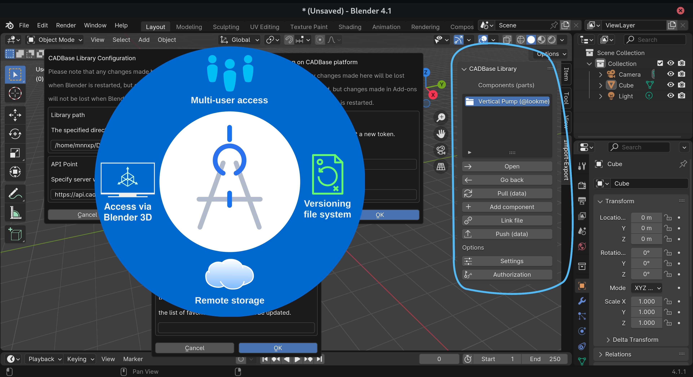
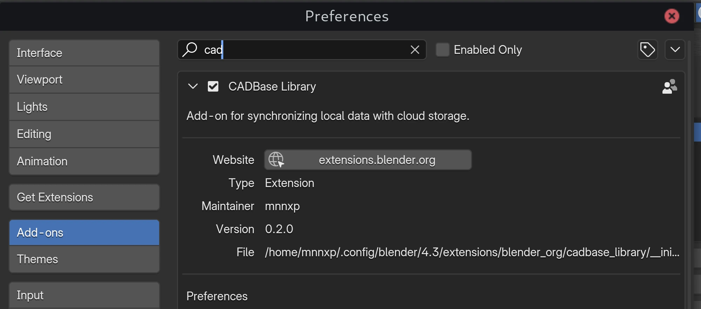
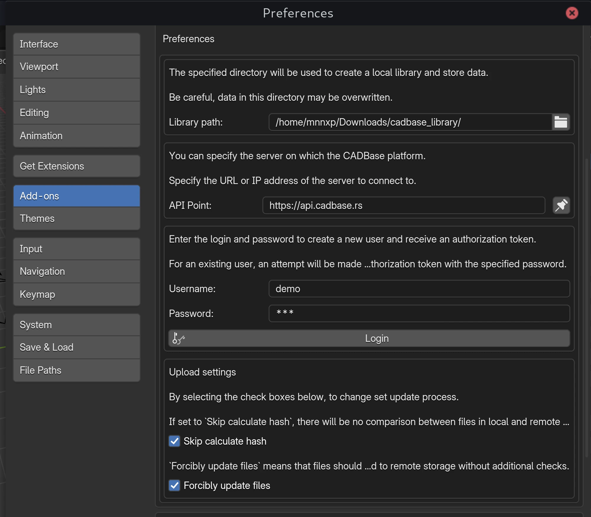
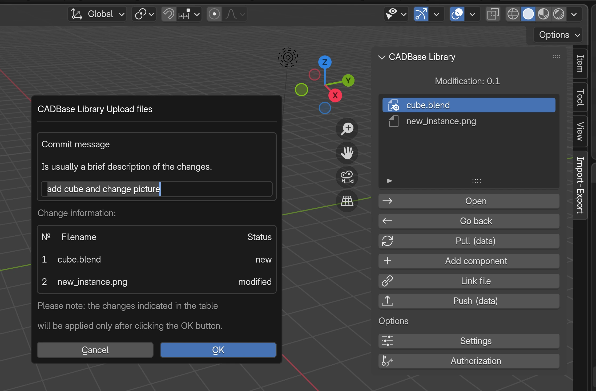

# Add-on CADBase Library

This add-on allows the user to interact with CADBase (upload and download parts) via the Blender interface.  
CADBase is a platform for publishing and sharing information about 3D components (parts), drawings and manufacturers.

**Important Note:**  To use the add-on, you must have an account on the [CADBase Platform](https://app.cadbase.rs). You can also create an account via add-on, if the entered username is free, a new user will be created with the specified username and password.

## Description

The add-on is designed to use components from CADBase in the Blender interface.  
Component modifications contain sets of files for various CAD systems. This add-on will work with data from the Blender set, without downloading documentation and data from other file sets.  
Files uploaded to file sets are versioned, allowing you to restore earlier versions, get the old state they were in before the changes, review the changes, and find out who last changed something and caused the problem.

### Dependencies

This add-on requires no additional steps and will work without additional libraries. But Blake3 can be used if it is already installed and is version-compatible with Blender 3D running.

**Please Note:** The add-on will work without this _Blake3_ library.

### Settings

#### Configuration CADBase Library

First you need to set the library location. CADBase remote storage will be synchronized with this location. Also there will storage files with technical data for add-on.  
This location can be changed in the add-on settings in the field _Library path_.

The local library location is specified in the **Library path** section field. When the location is changed, the data from the previous location will not be moved (it can be moved manually).

#### Getting an authorization token

On the CADBase Library card in the **Add-ons** section of the Blender “Preferences...” there are **username** and **password** fields.  
To obtain a token for an existing account or create a new account to access CADBase, you must provide a **username** and **password**. This data will be saved and available after restarting Blender.  
After entering these data to receive the token and pressing the **Login** button. Please wait until you receive the token.

**Important Note:**  If the access token has expired, you need to repeat the steps above.

##### Alternatively

The disadvantage (or advantage) of this option is that it only saves changes until Blender restarts. After a new startup, Blender restores the data if it is set in the Add-ons Manager.  
In the _CADBase Library_ window, click the **Authorization** button.  
When the _Authorization on CADBase platform_ window opens, you need to set a **username** and **password** in order to access CADBase.  
After entering these data to receive the token and pressing the **OK** button. Please wait until you receive the token.

#### Server URL

In the **Server URL** section you can set URL/IP for communication with the platform.

#### Upload settings

The **Upload settings** section allows you to set parameters to improve workbench operation in the absence of Blake3 and in case of necessity of forced updating of files on CADBase storage.

If you set **Forcibly update files** to True, the **Skip calculate hash** value will be ignored. The hash will not be calculated, as it is unnecessary.

The parameters affect only the uploading of data to the server. When downloading data, existing files will not be overwritten regardless of the settings.

### First start

Once installed, the add-on will be available in the **3D View** > **Sidebar menu**.  
Select the **CADBase Library** add-on in the **Import-Export** category.

### Control

 `Open` - open the next level (deeper). If a component of a list of user's favorite components is selected, it will open the list of modifications for that component; if a modification of a component modifications list is selected, it will open a set of files for Blender.

 `Go back` - return to the previous level (higher). If a set of files is open, the button opens a list of modifications of a component; if a list of modifications of a component is open, the button opens a list of a user's favorite component.

 `Pull (data)` - retrieves data from the remote server and updates the local library view.

 `Add component` - the button opens a modal window in which ability create a new component (part, project, etc.) with a given name.

 `Link file` - link creates a reference to the data in the source file such that changes made there will be reflected in the referencing file the next time it is reloaded.

 `Push (data)` - the button opens the window for downloading files from the Blender folder (set of files for Blender) of the local library to the CADBase repository.

 `Settings` - this button opens a modal window where you can specify the path to the local library, where the files received from CADBase will be stored, and the address of CADBase server.

 `Authorization` - this button opens a modal window where you can specify login and password from CADBase profile to get a new authorization token. This action must be repeated if the access token is revoked or expired.

_Changes made through Settings and Authorization will be reset when Blender restarts. For changes to be saved after restarting Blender, they must be made via Add-ons in Preferences..._

## Usage

Create new components with the add-on and add target components to bookmarks (favorites) on CADBase website.  
In Blender will only display components that the user has bookmarked on CADBase platform, as well as those that have been previously downloaded.

### CADBase Library Browser

Favorite components are displayed at root level. After selecting and opening a component, a list of its modifications is displayed this Component level. These levels correspond to the location of folders in the directory that is specified in the `Library path` property.
When you open a modification (modification level), it actually displays files from the Blender file set that is in the Blender folder, not directly in the modification folder.
Files for Blender will be downloaded through this add-on, files from kits for other programs will not be downloaded.

The data display can be divided into three levels, the first one is the root level (**rl**), this level displays all components from the local library, the second one is the component level (**cl**), it displays the list of modifications of the open component, and the third level displays the data of a set of files (**fl**). The folder for Blender file set in local storage is created regardless of the presence of file set in the modification on CADBase platform, the file set will be created automatically when sending files.

<pre>
-Library path                       # set in add-on (<b>rl</b>)
├── Vertical Pump (@lookme)         # component folder (<b>cl</b>)
│   ├── N1                          # modification folder
│   │   ├── Blender                 # Blender fileset (<b>fl</b>)
│   │   │   ├── modification        # technical data file
│   │   │   ├── vertical Pump.blend # file of the Blender fileset
│   │   │   └── ...                 # files of the Blender fileset
│   │   ├── FreeCAD                 # FreeCAD fileset (<b>fl</b>, for example)
│   │   └── ...                     # filesets for the modification (<b>fl</b>)
│   ├── ...                         # modifications of the component
│   └── component                   # technical data file
├── ...                             # local library components (<b>rl</b>)
├── cadbase_file_2018.log           # stores logs and responses (optional)
└── cadbase_file_2018               # technical data file
</pre>

### Getting data

To get the data, click on the **Pull (data)** button. Depending on the open position (directory), this will start the process of retrieving a list of the user's favorite components, a list of component modifications, or downloading files from the file set of the selected component modification for Blender.

### Sending data

Open the modification from which you want to upload the files.  
Click the **Push (data)** button to upload the local files for the set of component modification files to CADBase storage (remote storage).  
Information about the upload process will be displayed in the Blender report.

Only files from Blender file set will be loaded to CADBase storage.

Click the **Upload files** button to process data and display information about detected changes between local and remote storage. The local storage (library) is considered to be the reference storage.

The **Commit message** section can optionally contain a message that allows users to better understand what has changed in this update. The message will be associated with all files that were added or changed in this update and can be viewed on the platform's website.

Files affected by the update will be displayed in the table under the **Commit message** section. In addition to the file names, the type of changes is indicated:
 * `new` - the file is not detected in the remote storage and will be uploaded as a new one
 * `modified` - the file exists in remote storage and will be updated to the new revision
 * `deleted` - the file no longer exists locally and will be deleted from remote storage in this update

Click the **Ok** button for upload local files of select modification folder to CADBase storage (cloud).

## Additional Information

##### Add-on settings

The add-on's settings, such as the local library path, server (API Point) address, and access token, are stored in the Blender user settings file (`userpref.blend`), which is located at the path `bpy.utils.resource_path('USER')/config`.

##### Used (reserved) names in the add-on

Please don't use `cadbase_file_2018` and `cadbase_file_2018.log` as file or folder names in the library path folder. These files store server responses and logs, if you use these filenames for your data, you may lose them.  
If you need to save logs to a file (for example, for debugging, study, or other purposes), you need to create a _cadbase_file_2018.log_ file in your local library folder.  

In component folders, a `component` file is created with the technical data about the component.  
In fileset folders, a `modification` file is created with the technical data about the component modification and fileset.

##### How the add-on work with data

To avoid losing local data when downloading from CADBase storage (from remote storage), files already in local storage are skipped.  
Before uploading files to CADBase storage (remote storage), the add-on checks for existing files in the remote storage and excludes files from the upload list if their local and remote storage hashes match. A hash is calculated using the Blake3 library.  
This check is skipped and previously uploaded files (already in remote storage) are not updated unless the Blake3 library is installed.

## Links

Add-on development happens in [this](https://gitlab.com/cadbase/cadbaselibrary-blender) repository (GitLab).

Mirrors on [GitHub](https://github.com/mnnxp/cadbaselibrary-blender) and [Codeberg](https://codeberg.org/mnnxp/cadbaselibrary-blender).

About CADBase Platform on [YouTube](https://www.youtube.com/@cadbaseplatform)

## Version

v0.2.0 2025-01-26    * implemented preview of changes before sending update, added deletion of old files from remote storage, updated API, removed wheels ([#8](https://gitlab.com/cadbase/cadbaselibrary-blender/-/issues/8))

v0.1.5 2024-11-29    * added ABI Python 3.11 (Blake3 wheels), ABI 3.12 is incompatible with official releases, both Python 3.11 and 3.12 are now supported

v0.1.4 2024-08-09    * fixed to work with updated versions of Blender and Python, updated wheels, corrected incorrect importing

v0.1.3 2024-06-07    * updated manifest

v0.1.2 2024-05-29    * added ability to create a component, error handling, support for online_access property and automatic installation of blake3 dependencies

v0.1.1 2024-05-24    * added bug information and updated translations

v0.1.0 2024-05-19    * updated links, save settings in userpref.blend, added ability to create an account via add-on

v0.0.2 2024-04-18    * added blender manifest, description and fixed bugs

v0.0.1 2024-04-14    * first release
