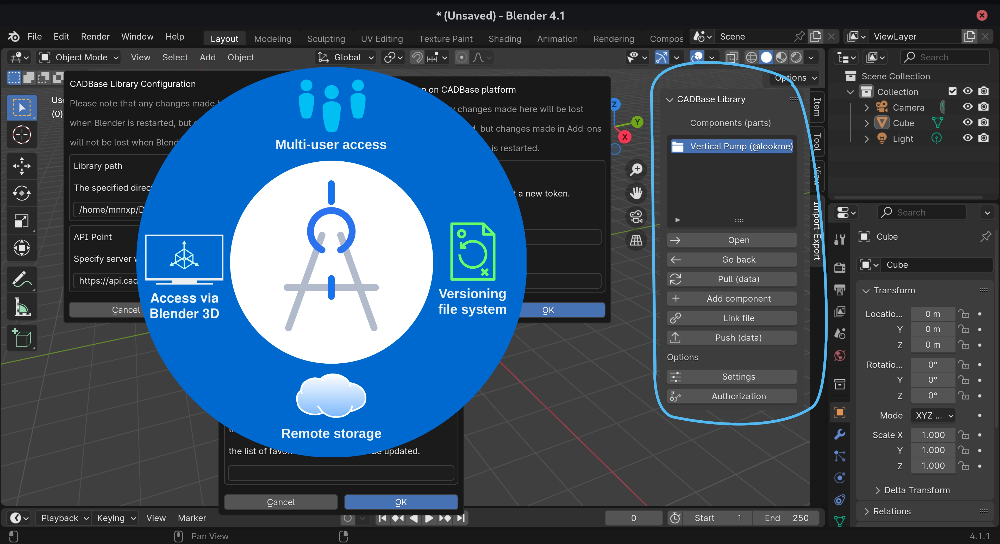
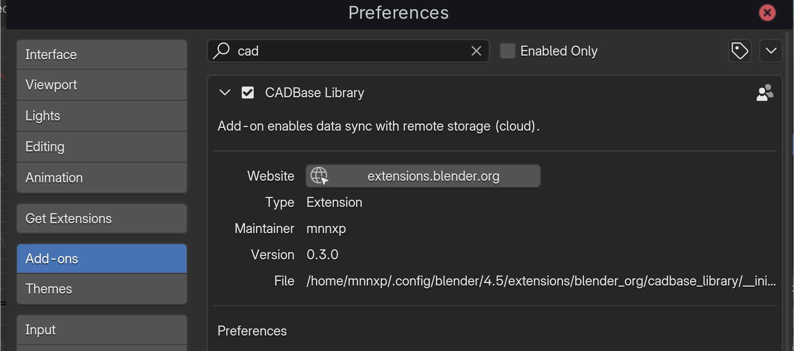
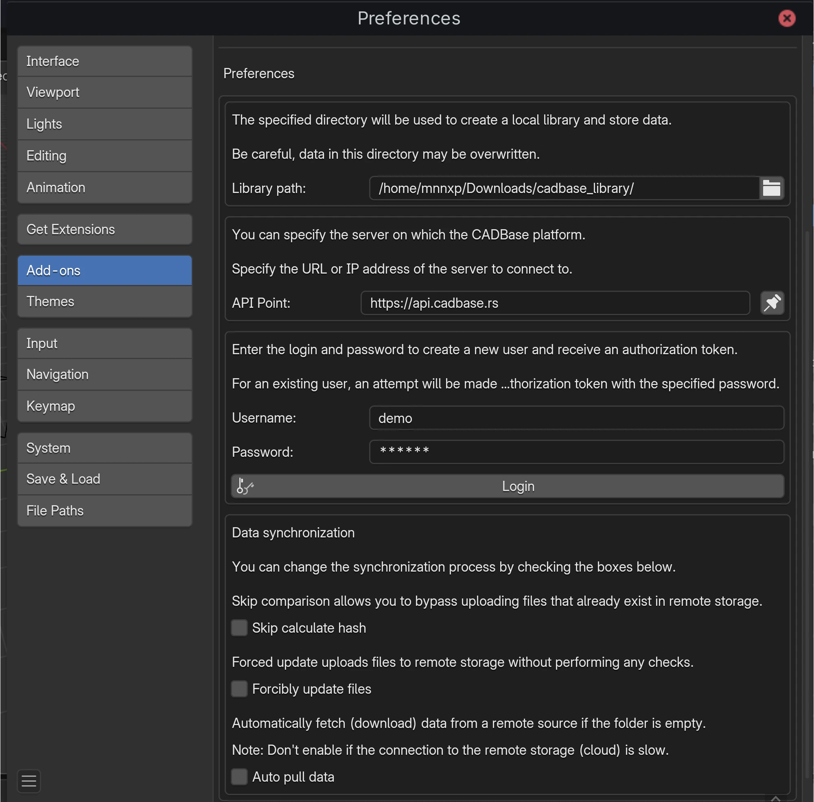
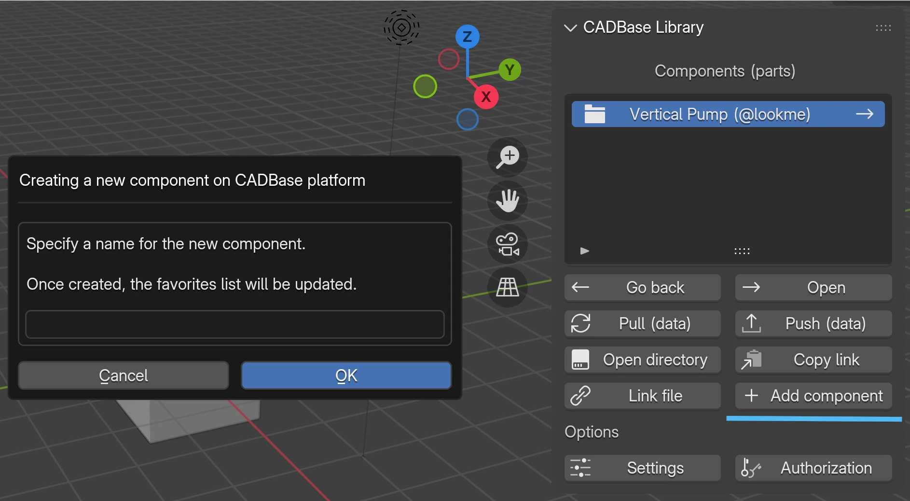
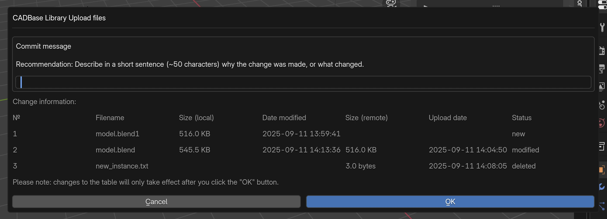

# Add-on CADBase Library

[](https://www.gnu.org/licenses/lgpl-3.0)
[](https://blender.org)

<div align="center"></div>

This add-on allows users to interact with CADBase via the Blender interface.  
CADBase is a platform for publishing and sharing information about components (parts), 3D models, drawings, and manufacturers.

**Important Note:** To use the add-on, you must have an account on the [CADBase Platform](https://app.cadbase.rs).  
You can also create an account directly through the add-on. If the entered username is available, a new user will be created with the specified username and password.

## Description

Component modifications include sets of files for various CAD systems. This add-on works with data from Blender’s file sets without downloading documentation or data from other file sets.  
Files uploaded to file sets are versioned, allowing you to restore earlier versions, compare changes, review modifications, and track who last edited them.

<div align="center"></div>

### CADBase Library Browser

Favorite components are displayed at the root level. Selecting and opening a component shows its list of modifications at this component level. These levels correspond to folder locations in the directory specified in the **Library path** property.  
When you open a modification, it displays files from the Blender file set within the Blender folder—not directly from the modification folder on CADBase.  
Files for Blender are downloaded through this add-on; files for other CAD programs are not.

The data display is organized into three levels:

- **Root level (`rl`)**: Displays all local library components.
- **Component level (`cl`)**: Shows the list of modifications for the selected component.
- **File set level (`fl`)**: Displays files within a selected modification’s Blender file set.

The folder for Blender files in local storage is created automatically when files are uploaded, regardless of whether the modification exists on CADBase.

**Folder structure example:**

```plaintext
-Library path                       # set in add-on (rl)
├── Vertical Pump (@lookme)         # component folder (cl)
│   ├── N1                          # modification folder
│   │   ├── Blender                 # Blender fileset (fl)
│   │   │   ├── modification        # technical data file
│   │   │   ├── vertical Pump.blend # Blender file
│   │   │   └── ...                   # other files
│   │   ├── FreeCAD                   # FreeCAD fileset (fl)
│   │   └── ...                       # other filesets
│   ├── ...                           # other modifications
│   └── component                     # technical data file
├── ...                               # other components
├── cadbase_file_2018.log             # logs and responses (optional)
└── cadbase_file_2018                 # technical data file
```

## Dependencies

The workbench does not require external dependencies.

## Settings

### CADBase Library Configuration

First, set the library location. This path will be synchronized with CADBase remote storage, and files with technical data will be stored here.  
You can change this in the add-on settings under **Library path**.

### Server URL

Set the URL or IP address of the CADBase server in the **Server URL** section.

### Authorization Token

In Blender's Preferences under the **Add-ons** section, you'll find **username** and **password** fields on the CADBase Library card.  
Enter your credentials to obtain an authorization token. If successful, the token will be saved and available after restarting Blender.  
If the token expires, repeat this process.

**Alternatively:**

You can click the **Authorization** button within the _CADBase Library_ window.  
In the window, you'll be prompted to enter your username and password (if you haven't done so before) to obtain a new token.

### Data Synchronization Settings

The **Data synchronization** section allows you to optimize performance and control file verification:

- **Skip calculate hash:** If this option is enabled, files will not be compared using hashes; this is useful for skipping updates of existing files in remote storage.
- **Forcibly update files:** When enabled, hash verification is skipped, and files are uploaded in all cases.
- **Auto pull data:** If enabled, data will be automatically downloaded when opening an empty folder.

<div align="center"></div>

## First Start

After installation, the add-on appears in Blender's **3D View** > **Sidebar** under the **Import-Export** category.  
Select **CADBase Library** to begin.

## Control Buttons

- **Go back:** Return to the previous level (higher). If a set of files is open, it shows the list of modifications; if a modification is open, it returns to the component list.
- **Open:** Navigate to a deeper level—open modifications, file sets, or files.
- **Pull (data):** Retrieve data from the remote platform, updating the local and navigation view.
- **Push (data):** Open a window to upload local files to CADBase.
- **Open directory:** Open the folder containing the selected file/directory in your system’s file explorer.
- **Copy link:** Copy the URL of a selected component to the clipboard.
- **Link file:** Incorporates objects from the file into the current scene, allowing them to be displayed and edited within Blender.
- **Add component:** Create a new component via a modal dialog.
- **Settings:** Configure the local library path and CADBase server address.
- **Authorization:** Enter login credentials to generate or refresh the access token.

## Usage

Create new components or add existing ones to bookmarks on the CADBase website.  
The Blender interface will only display components bookmarked on CADBase or previously downloaded.

### Data Retrieval and Download

Click **Pull (data)** to retrieve favorite components, modifications, or download files from a selected modification.

### Create Components

Use **Add component** to create a new component on CADBase.  
This opens a modal window for entering the component name.

<div align="center"></div>

### Upload Data

Open the desired modification and click **Push (data)** to upload local files to CADBase.  
The process and progress will be shown in Blender's report.

Only Blender file set files are uploaded.

You can also compare local and remote files before uploading.  
A **Commit message** can be added to describe the changes.  
Affected files are listed with change types:
- `new`: Not on remote, will be uploaded
- `modified`: Will be updated
- `deleted`: Will be removed from remote

Click **Ok** to confirm upload.

<div align="center"></div>

## Additional Information

### Add-on Settings

Settings are stored in Blender's user preferences file (`userpref.blend`), located at:  
`bpy.utils.resource_path('USER')/config`

### Reserved Names

In component folders, a `component` file is created containing the technical data about the component.
In fileset folders, a `modification` file is created containing the technical data about the component modification and fileset.

Avoid using `cadbase_file_2018` and `cadbase_file_2018.log` as filenames or folder names in your library, as these are reserved for logs and server responses.  
Create your own log files manually if needed.

### How the Add-on Works with Data

To prevent data loss, existing local files are skipped during downloads.  
When uploading, files are typically checked with hashes (SHA-256) to avoid unnecessary uploads if files haven't changed, unless the **Force update** setting is enabled.

## Links

- CADBase Library Add-on: [Blender Extensions](https://extensions.blender.org/add-ons/cadbase-library/)
- Development repository: [GitLab](https://gitlab.com/cadbase/cadbaselibrary-blender)
- Mirrors: [GitHub](https://github.com/mnnxp/cadbaselibrary-blender), [Codeberg](https://codeberg.org/mnnxp/cadbaselibrary-blender)
- About CADBase Platform: [Website](https://cadbase.rs/), [YouTube](https://www.youtube.com/@cadbaseplatform)

## Version History

- **v0.3.0 (2025-09-09):**  
  Implemented comparison of data by SHA-256 hash using `hashlib`, added buttons for opening local folders and copying component links, duplicated navigation buttons, introduced an auto-pull feature that activates when opening a folder.

- **v0.2.0 (2025-01-26):**  
  Added preview of changes before updates, support for deleting old remote files, updated API, removed wheels dependency ([#8](https://gitlab.com/cadbase/cadbaselibrary-blender/-/issues/8)).

- **v0.1.5 (2024-11-29):**  
  Supported Python 3.11 (Blake3 wheels), noted incompatibility with Python 3.12, both are now supported.

- **v0.1.4 (2024-08-09):**  
  Fixed compatibility with newer Blender and Python versions, updated wheels, corrected import issues.

- **v0.1.3 (2024-06-07):**  
  Updated manifest.

- **v0.1.2 (2024-05-29):**  
  Added component creation, error handling, support for `online_access` property, and automatic Blake3 dependency installation.

- **v0.1.1 (2024-05-24):**  
  Added bug reporting info, updated translations.

- **v0.1.0 (2024-05-19):**  
  Updated links, saved settings in preferences (userpref.blend), added account creation via add-on.

- **v0.0.2 (2024-04-18):**  
  Added Blender manifest, description, and bug fixes.

- **v0.0.1 (2024-04-14):**  
  First release.
